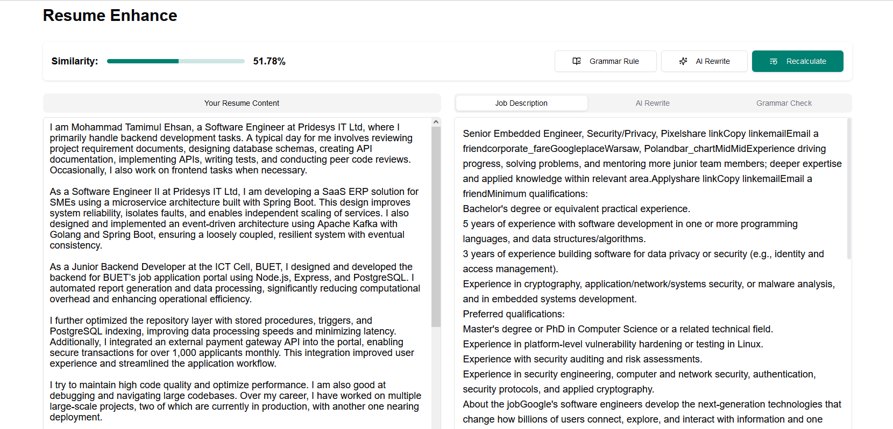
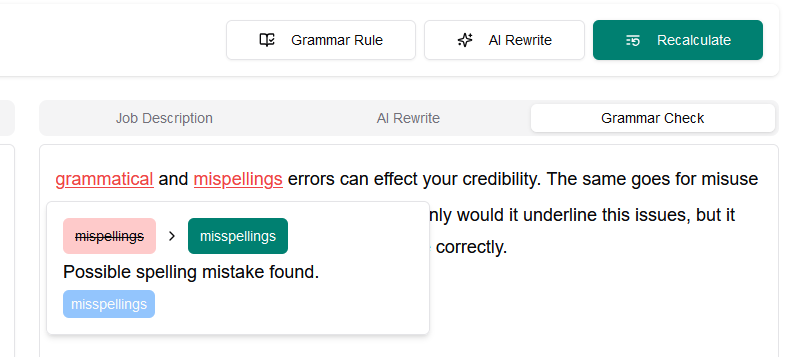
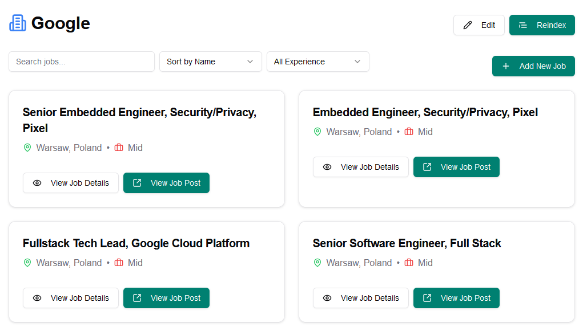
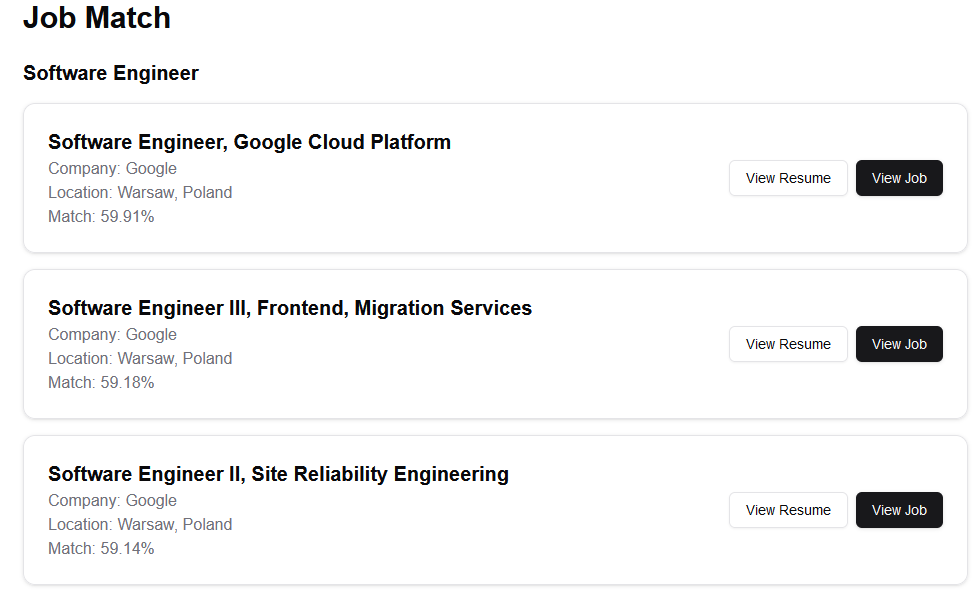

# Chakri Koi?
Chakri koi is an one stop solution to make your job search a bit easier. Add resumes, scrap your favourite company career website, match the job description to your resume and many more!

> [!NOTE]
> The software is still work in progress and not ready for public usage.

## Synopsis
Every month I have to search career website of at least 20+ companies to find suitable jobs for myself. On average I have to search more than 50 jobs per company and select 3-5 jobs most suitable. It's very time consuming and repetative. Hence, the idea of chakri koi?

## ⚡️ Features

The software provides multiple features:

### 📝 Resume


You can add different variant of your resume. eg: a resume for backend development or may be one for devops. Chakri koi will create and store a vector embedding of your resume to better find a match for you!

### 📈 Company 




You can add multiple companies in the software. You can add jobs under the company manually or let chakri koi scrap them for you. However, scraping is a bit technical. So, you will need to add some preconfiguration for it. Luckily, there are some precofigured scrapping added for some companies! The jobs are vectorized for matching with your resumes.

### ✨ Matching

The most interesting part of the software is the matching. Using **Sentence BERT** model `paraphrase-MPNet-base-v2` chakri koi will suggest you the most suitable jobs that you can apply for! 

You can also edit your resume in an interactive editor to iteratively improve your match with a target job. This will definitely help you to make your resume stand out. 

## 🚀 Running locally

At first launch the postgres container
```bash
docker compose up
```
Then launch the model generator app
```bash
# change directory
cd model
# create virtual environemt
python -m venv venv
# activate virtual environment
./venv/Scripts/activate
# install dependencies
pip install -r requirements.txt
# run server
fastapi run server.py
```

The launch the next js server
```bash
# change directory
cd server
# install dependencies
npm i
# run server
npm run dev
```

You can find your app running at `localhost:3000`

## 🚨 Caution

### Respect robots.txt
Not every website allow scraping. See the allowed list of sites for scraping and the rate from their robots.txt file

### Breaking scraping
Getting the right css selector is very tough. I am working to make it better. Currently I only added the capability to scrap paginated sites. Will make it more universal may be someday.

## Conclusion
If you like this please give it a star. If you want to contribute to it, please create an issue first describing the changes first. Proceed only after getting a green signal. 