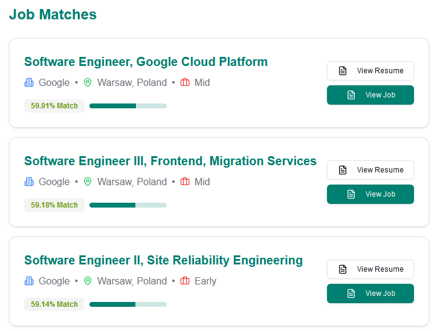

<div align="center">
	
	<h1>Chakri Koi?</h1>
	<h3>Your one stop solution to make job search a bit easier.</h3>
	<h4>Scrape Job Sites | Match Jobs | Modify Resume</h4>
	<p>
		<a name="stars"></a>
	</p>
	<p>Show your support by giving a ⭐ to this repo</p>
</div>

Chakri koi is an one stop solution to make your job search a bit easier. Add resumes, scrap your favourite company career website, match the job description to your resume and many more!

> [!NOTE]
> The software is still work in progress and not ready for public usage.

## Synopsis
Every month I have to search career website of at least 20+ companies to find suitable jobs for myself. On average I have to search more than 50 jobs per company and select 3-5 jobs most suitable. It's very time consuming and repetative. Hence, the idea of chakri koi?

## ⚡️ Features

The software provides multiple features:

### 📈 Company 


- **Company Management:** Store crucial information about your next potential hiring company.
- **Site Scraping:** With some guidance and templates, chakri koi will scrape the career websites for you and gather all the jobs in one place. However, scraping is a bit technical. So, you will need to add some preconfiguration for it. Luckily, there are some precofigured scrapping added for some companies!

### Job 

- **Job Management:** You can add jobs under the company manually or let chakri koi scrap them for you.
- **Vector Embedding:** Chakri koi will create and store a vector embedding of the jobs to better find a match for you!

### 📝 Resume


- **Resume Management:** Store different versions of your resume based on role, skills etc.
- **Vector Embedding:** Chakri koi will create and store a vector embedding of your resume to better find a match for you!
- **Resume Editor:** You can edit your resume content in the site and let your AI agent rewrite it into a more cohesive format.
- **Grammar Checker:** With a light weight grammar checker, you can check for spelling mistakes and grammatical errors in your resume. 

### ✨ Matching


- **Job Recommendation:** The most interesting part of the software is the matching. Using **Sentence BERT** model `paraphrase-MPNet-base-v2` chakri koi will suggest you the most suitable jobs that you can apply for! 
- **Realtime Similarity Checker:** You can edit your resume content in the site and check the change of similarity thus increasing your chance for your next job.

## 🚀 Running locally

At first launch the postgres container
```bash
docker compose up
```
Then launch the model generator app
```bash
# change directory
cd model
# create virtual environemt
python -m venv venv
# activate virtual environment
./venv/Scripts/activate
# install dependencies
pip install -r requirements.txt
# run server
fastapi run server.py
```

The launch the next js server
```bash
# change directory
cd server
# install dependencies
npm i
# run server
npm run dev
```

You can find your app running at `localhost:3000`

## 🧠 Chosing the Right Model
All of the NLP models used in the project are from huggingface and are run locally. If you also prefer to run locally, you can chose your preffered model based on your hardware configuration. You can also opt in to use OpenAI. However, I do not have any api key for OpenAI, thus can't integrate it with the software.

## 🔧 Tools Used 
- **Frontend:** `React`, `Shadcn UI`, `Tailwind CSS`
- **Backend:** `NextJS`, `FastAPI`
- **Database:** `PostgreSQL`, `PgVector`
- **NLP Model:** `paraphrase-MPNet-base-v2`, `pszemraj/flan-t5-large-grammar-synthesis`
- **Python Tools:** `transformers`, `language_tool_python`
 
## 🚨 Caution

### Respect robots.txt
Not every website allow scraping. See the allowed list of sites for scraping and the rate from their robots.txt file

### Breaking scraping
Getting the right css selector is very tough. I am working to make it better. Currently I only added the capability to scrap paginated sites. Will make it more universal may be someday.

## Conclusion
If you like this please give it a star. If you want to contribute to it, please create an issue first describing the changes first. Proceed only after getting a green signal. 